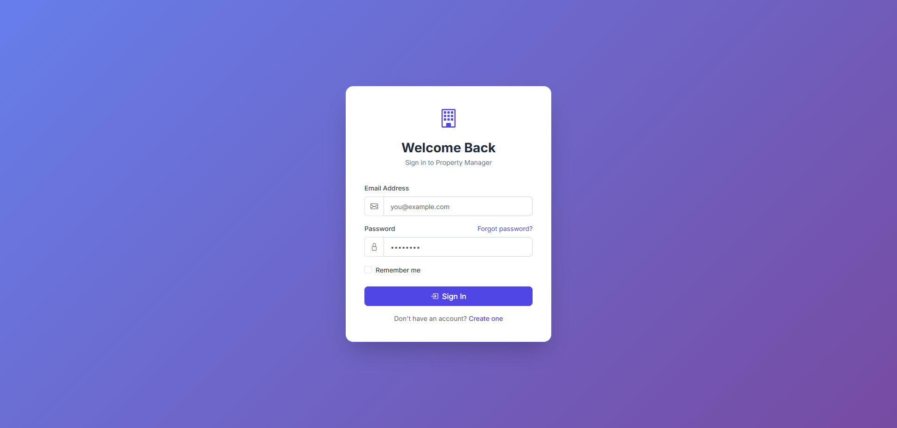
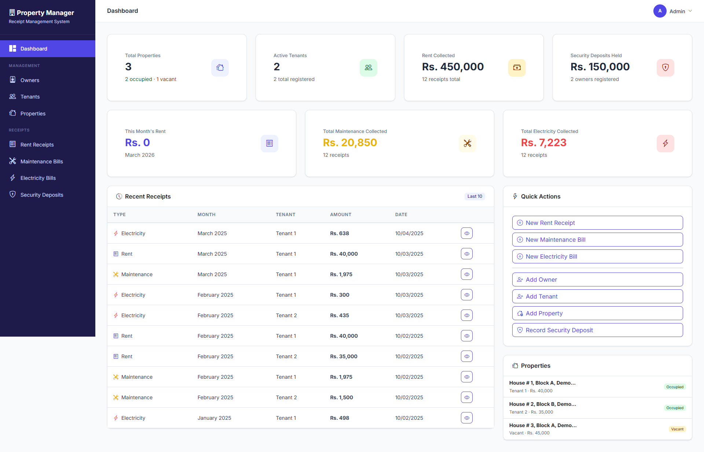
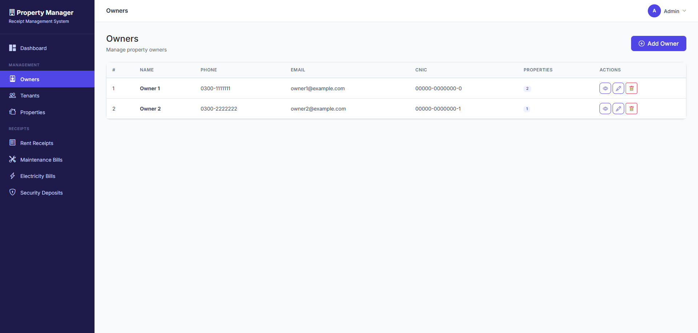
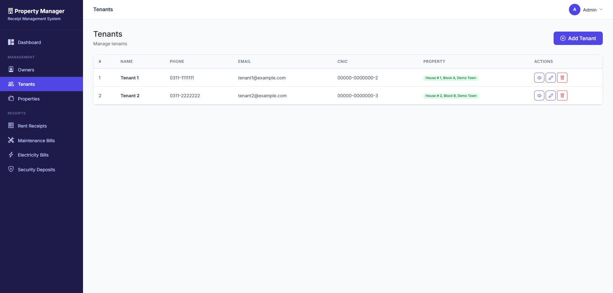
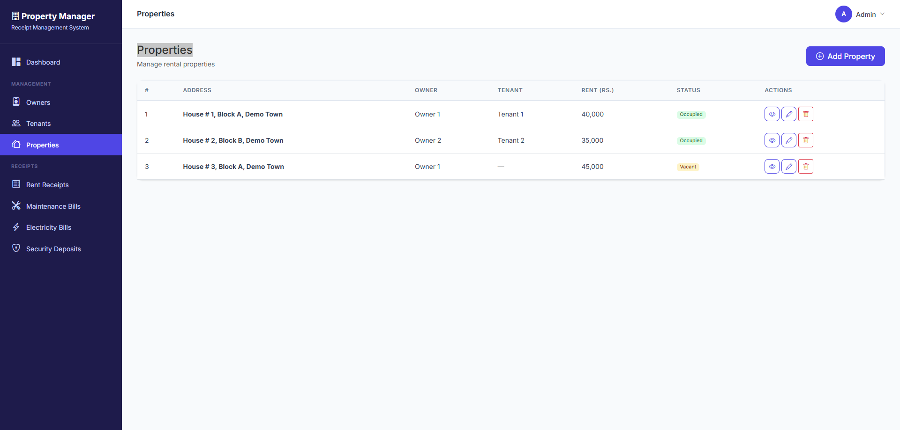
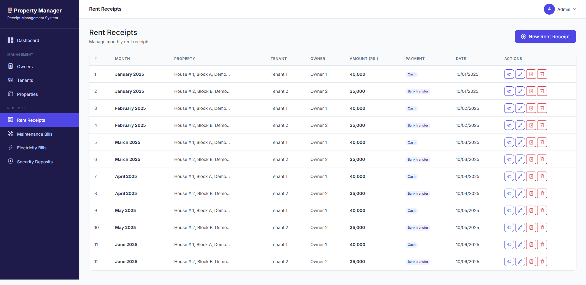
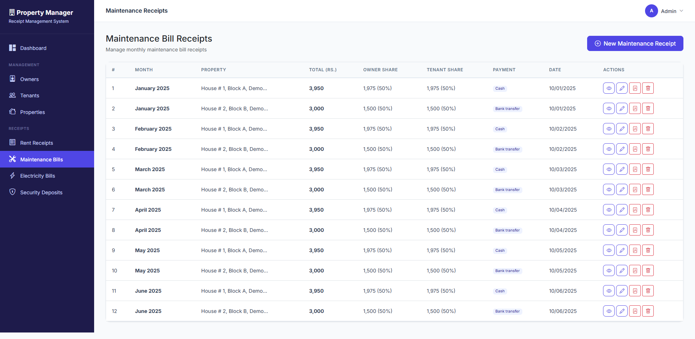
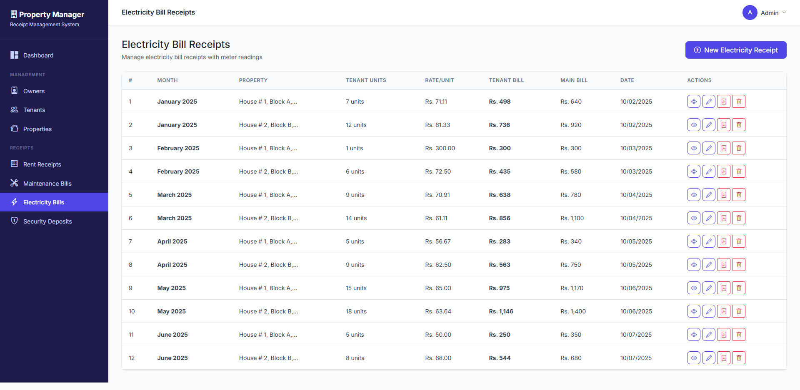
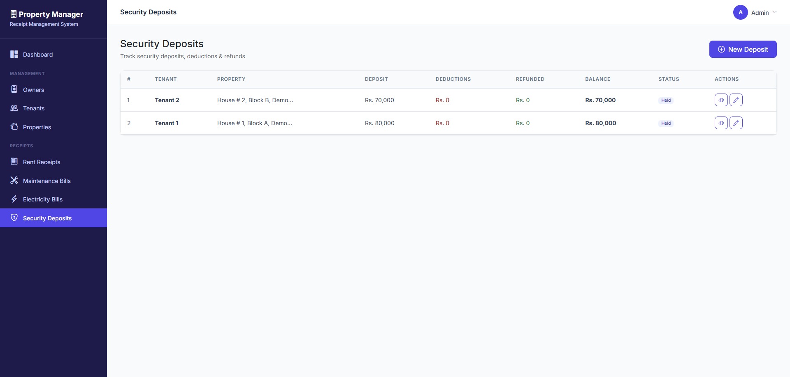

<div align="center">


<br/>

[](https://php.net)
[](https://laravel.com)
[](https://getbootstrap.com)
[](https://mysql.com)
[](LICENSE)

<br/>

[](https://github.com/mohsin-rafique/property-management/stargazers)
[](https://github.com/mohsin-rafique/property-management/network/members)
[](https://github.com/mohsin-rafique/property-management/issues)
[](https://github.com/mohsin-rafique/property-management/releases)

<br/>

### A complete, production-ready rental property management platform — free and open source.

**Manage tenants, rent, electricity, maintenance bills, and security deposits from a single, beautiful dashboard.**

<br/>

[**Live Demo**](https://github.com/mohsin-rafique/property-management) &nbsp;•&nbsp;
[**Features**](#-features) &nbsp;•&nbsp;
[**Screenshots**](#-screenshots) &nbsp;•&nbsp;
[**Quick Start**](#-quick-start) &nbsp;•&nbsp;
[**Tech Stack**](#-tech-stack) &nbsp;•&nbsp;
[**Roadmap**](#-roadmap) &nbsp;•&nbsp;
[**Hire Me**](#-hire-the-author)

<br/>

> **Demo Login:** `admin@admin.com` / `password`

<br/>

---

### If this project saves you time or inspires you, please give it a ⭐ Star — it helps more people discover it!

---

</div>

<br/>

## What Is This?

**Property Management System** is a free, self-hosted web application that replaces messy spreadsheets and paper records with a clean, role-based digital platform. It is designed for:

- **Property owners** who manage one or more rental units and want a professional paper trail
- **Real estate managers** handling multiple properties across different owners
- **Developers** looking for a real-world Laravel 12 reference project to learn from or extend into a SaaS product

Built with **Laravel 12**, **PHP 8.2+**, **Bootstrap 5**, and **DomPDF**, the system is lightweight and runs on any standard shared hosting or VPS — no Docker, no cloud lock-in.

<br/>

---

## The Problem It Solves

Most landlords still track rent in WhatsApp chats, phone notes, or Excel files. This creates:

| Pain Point | Without This System | With This System |
|---|---|---|
| Rent records | Scattered across notebooks/chats | Centralized, searchable, PDF-ready |
| Electricity bills | Manual calculator per month | Auto-calculated from WAPDA bill |
| Maintenance splits | Guesswork or disputes | Configurable % split, receipt proof |
| Security deposits | No audit trail | Full deduction history + photo evidence |
| Tenant access | Phone calls to request slips | Self-service tenant portal |
| Multi-user access | Single shared spreadsheet | Role-based accounts (Admin/Owner/Tenant) |

<br/>

---

## Features

### Dashboard & Analytics

- Live statistics: total properties, tenants, rent collected, deposits held
- Current month rent collection at a glance
- Recent activity feed across all modules
- Occupancy overview (Vacant vs Occupied)
- Quick-action buttons for common tasks

### Property Management

- Add unlimited rental properties
- Assign owners and tenants per property
- Track occupancy status (Vacant / Occupied)
- Automatic rate history log when rent changes
- Configurable maintenance split percentage per property

### Owner Management

- Full create / read / update / delete with linked user account creation
- Owner-scoped data isolation (owners see only their own properties)
- View all receipts per owner
- Contact details and CNIC tracking

### Tenant Management

- Full CRUD with automatic user account creation
- Dedicated read-only tenant portal
- Tenants view their own receipts and download PDFs without contacting the landlord
- Payment history and deposit status visible to tenant

### Rent Receipts

- One-click monthly receipt generation
- Amount in words auto-generated in Pakistani format (Lakh / Crore)
- Tenant, owner, and amount auto-filled from property profile
- Payment method tracking: Cash, Bank Transfer, Cheque, Online
- Professional PDF download matching standard rental formats

### Maintenance Bill Receipts

- Automatic owner/tenant cost-split calculation
- Configurable split percentage (default 50/50, set per property)
- Live calculation preview before submitting
- Original bill attachment upload
- Bill reference number tracking
- Professional PDF download

### Electricity Bill Receipts

- Rate per unit auto-calculated from WAPDA bill (Total Payable ÷ Main Meter Units)
- Main meter and sub-meter reading entry
- Previous readings auto-filled from the last receipt
- Live billing breakdown: tenant portion vs owner portion
- Sub-meter photo evidence upload (previous and current)
- Original WAPDA bill attachment
- Detailed cost distribution PDF

### Security Deposits

- Record deposits in configurable months of rent
- Add deductions with written reasons and photo proof
- Process partial or full refunds at any time
- Auto-calculated remaining balance
- Status progression: **Held → Partially Refunded → Fully Refunded**
- Complete deduction history per deposit

### Role-Based Access Control

| Role | Access Level |
|---|---|
| **Admin** | Full access — all modules, all users, all data |
| **Owner** | Own properties, own receipts, own tenant records only |
| **Tenant** | Read-only portal — own receipts, own deposit status |

### PDF Generation

- Professional receipt layout matching standard Pakistani rental formats
- Acknowledgment text and signature section included
- Meter readings on electricity receipts
- Cost distribution breakdown table
- Notes and bill references included
- Download from any receipt detail page

<br/>

---

## Screenshots

<p align="center">
  
  <br/><sub><b>Login Page</b> — Clean, secure entry point for Admin, Owner, and Tenant accounts</sub>
</p>

<br/>

<p align="center">
  
  <br/><sub><b>Admin Dashboard</b> — Live stats, recent activity, occupancy summary, and quick actions</sub>
</p>

<br/>

<p align="center">
  
  <br/><sub><b>Owner Management</b> — Full CRUD with linked user accounts and property overview</sub>
</p>

<br/>

<p align="center">
  
  <br/><sub><b>Tenant Management</b> — Manage tenants, view their receipts, access their portal</sub>
</p>

<br/>

<p align="center">
  
  <br/><sub><b>Properties</b> — Track all units, assigned owners/tenants, occupancy status, and rate history</sub>
</p>

<br/>

<p align="center">
  
  <br/><sub><b>Rent Receipts</b> — Auto-filled forms, amount-in-words, PDF generation</sub>
</p>

<br/>

<p align="center">
  
  <br/><sub><b>Maintenance Receipts</b> — Live cost-split calculator with bill attachment</sub>
</p>

<br/>

<p align="center">
  
  <br/><sub><b>Electricity Receipts</b> — WAPDA rate calculator, meter photo evidence, detailed PDF</sub>
</p>

<br/>

<p align="center">
  
  <br/><sub><b>Security Deposits</b> — Deduction history, photo proof, refund tracking</sub>
</p>

<br/>

---

## Tech Stack

<div align="center">

| Layer | Technology |
|---|---|
| **Backend Framework** | Laravel 12 |
| **Language** | PHP 8.2+ |
| **Frontend** | Bootstrap 5 + Blade Templates |
| **CSS Tooling** | Tailwind CSS 4 + Sass |
| **Build Tool** | Vite 7 |
| **PDF Engine** | DomPDF (barryvdh/laravel-dompdf) |
| **Database** | MySQL 5.7+ / MariaDB 10.3+ |
| **Authentication** | Laravel UI (session-based) |
| **Testing** | PHPUnit 11 |
| **Code Style** | Laravel Pint |

</div>

<br/>

---

## Quick Start

### Requirements

| Requirement | Version |
|---|---|
| PHP | 8.2 or higher |
| MySQL / MariaDB | 5.7+ / 10.3+ |
| Composer | 2.x |
| Node.js | 20+ |
| npm | 9+ |
| Web Server | Apache / Nginx |

**Required PHP Extensions:** `pdo_mysql`, `mbstring`, `openssl`, `tokenizer`, `xml`, `ctype`, `json`, `bcmath`

<br/>

### One-Command Setup

```bash
composer run setup
```

This single command runs: `composer install` → copy `.env` → generate app key → run migrations → `npm install` → `npm run build`

<br/>

### Step-by-Step Setup

#### 1. Clone and Install

```bash
git clone https://github.com/mohsin-rafique/property-management.git
cd property-management
composer install
npm install && npm run build
```

#### 2. Environment Configuration

```bash
cp .env.example .env
php artisan key:generate
```

#### 3. Database Setup

```sql
CREATE DATABASE property_management CHARACTER SET utf8mb4 COLLATE utf8mb4_unicode_ci;
```

Update your `.env` file:

```env
DB_CONNECTION=mysql
DB_HOST=127.0.0.1
DB_PORT=3306
DB_DATABASE=property_management
DB_USERNAME=your_username
DB_PASSWORD=your_password
```

#### 4. Migrate and Seed

```bash
# Run migrations
php artisan migrate

# Seed with demo data (recommended for first run)
php artisan db:seed
```

The seeder creates:
- 1 Admin account
- 2 Owner accounts with profiles
- 2 Tenant accounts with profiles
- 3 Properties (2 occupied, 1 vacant)

#### 5. Storage Link

```bash
php artisan storage:link
```

#### 6. Launch

```bash
php artisan serve
```

Open `http://localhost:8000`

<br/>

### Demo Accounts

| Role | Email | Password |
|---|---|---|
| Admin | admin@admin.com | password |
| Owner 1 | owner1@example.com | password |
| Owner 2 | owner2@example.com | password |
| Tenant 1 | tenant1@example.com | password |
| Tenant 2 | tenant2@example.com | password |

<br/>

---

## Production Deployment

### Apache Virtual Host

```apache
<VirtualHost *:80>
    ServerName your-domain.com
    DocumentRoot "/path/to/property-management/public"

    <Directory "/path/to/property-management/public">
        AllowOverride All
        Require all granted
    </Directory>
</VirtualHost>
```

Enable mod_rewrite:

```bash
sudo a2enmod rewrite && sudo systemctl restart apache2
```

### Nginx

```nginx
server {
    listen 80;
    server_name your-domain.com;
    root /path/to/property-management/public;
    index index.php;

    location / {
        try_files $uri $uri/ /index.php?$query_string;
    }

    location ~ \.php$ {
        include fastcgi_params;
        fastcgi_param SCRIPT_FILENAME $document_root$fastcgi_script_name;
        fastcgi_pass unix:/var/run/php/php8.2-fpm.sock;
    }

    location ~ /\.(?!well-known).* {
        deny all;
    }
}
```

### Production Checklist

```bash
# Set environment
APP_ENV=production
APP_DEBUG=false

# Optimize for production
php artisan optimize
php artisan config:cache
php artisan route:cache
php artisan view:cache
```

<br/>

---

## Security

This project follows Laravel and OWASP security best practices:

- **CSRF Protection** — `@csrf` tokens on every form
- **Password Hashing** — bcrypt via `Hash::make()`
- **Role-Based Middleware** — Admin / Owner / Tenant isolation enforced at route level
- **Owner Data Isolation** — Owners can only see their own properties and receipts
- **Tenant Data Isolation** — Tenants can only see their own data
- **Form Request Validation** — Dedicated FormRequest classes on all inputs
- **Mass Assignment Protection** — `$fillable` whitelist enforced on all models
- **SQL Injection Prevention** — Eloquent ORM with parameterized queries throughout
- **XSS Prevention** — Blade `{{ }}` auto-escaping on all output
- **Security Headers** — Custom middleware (X-Frame-Options, X-Content-Type-Options, etc.)
- **Login Rate Limiting** — Built-in throttle: 5 attempts per minute
- **Admin-Only Registration** — Public registration is disabled by design
- **File Upload Validation** — Type whitelist (PDF, JPG, PNG) + 25 MB size limit
- **Debug Off in Production** — `APP_DEBUG=false` prevents sensitive data exposure

<br/>

---

## Business Logic Reference

### Electricity Bill Calculation

```
Rate Per Unit  = Total WAPDA Bill Payable  ÷  Main Meter Units Consumed
Tenant Bill    = Tenant Sub-Meter Units    ×  Rate Per Unit
Owner Bill     = (Main Units − Tenant Units) × Rate Per Unit
Rounding Diff  = Main Bill − Tenant Bill − Owner Bill
```

### Maintenance Split

```
Owner Share   = Total Maintenance Amount × Owner Split %
Tenant Share  = Total Maintenance Amount × Tenant Split %
Default Split = 50% / 50% (configurable per property)
```

### Security Deposit

```
Remaining Balance = Total Deposit − Total Deductions − Total Refunded
Status Flow       = Held → Partially Refunded → Fully Refunded
```

<br/>

---

## Project Structure

```
property-management/
├── app/
│   ├── Http/
│   │   ├── Controllers/
│   │   │   ├── HomeController.php                  # Dashboard
│   │   │   ├── OwnerController.php
│   │   │   ├── TenantController.php
│   │   │   ├── PropertyController.php
│   │   │   ├── RentReceiptController.php
│   │   │   ├── MaintenanceReceiptController.php
│   │   │   ├── ElectricityReceiptController.php
│   │   │   ├── SecurityDepositController.php
│   │   │   └── TenantDashboardController.php
│   │   ├── Middleware/
│   │   │   ├── RoleMiddleware.php                  # Role-based access control
│   │   │   └── SecurityHeaders.php                 # Security headers
│   │   └── Requests/                               # Form validation classes
│   └── Models/
│       ├── User.php
│       ├── Owner.php
│       ├── Tenant.php
│       ├── Property.php
│       ├── RentReceipt.php
│       ├── MaintenanceReceipt.php
│       ├── ElectricityReceipt.php
│       ├── SecurityDeposit.php
│       ├── SecurityDepositDeduction.php
│       └── RateHistory.php
├── database/
│   ├── migrations/                                 # All schema migrations
│   └── seeders/
│       ├── DatabaseSeeder.php
│       └── DemoSeeder.php                          # Demo data
├── resources/views/
│   ├── layouts/app.blade.php                       # Main layout + sidebar
│   ├── auth/                                       # Login / register
│   ├── owners/                                     # Owner CRUD
│   ├── tenants/                                    # Tenant CRUD
│   ├── properties/                                 # Property CRUD
│   ├── rent-receipts/
│   ├── maintenance-receipts/
│   ├── electricity-receipts/
│   ├── security-deposits/
│   ├── tenant-portal/                              # Tenant self-service views
│   └── pdf/                                        # PDF receipt templates
├── routes/web.php
├── .env.example
├── composer.json
├── package.json
└── vite.config.js
```

<br/>

---

## Usage Guide

### Generating a Rent Receipt

1. Go to **Rent Receipts → New Rent Receipt**
2. Select a property — tenant, owner, and rent amount auto-fill
3. Select the billing month
4. Amount in words auto-generates in Pakistani format
5. Choose payment method and date
6. Submit → View receipt → Download PDF

### Generating an Electricity Receipt

1. Go to **Electricity Bills → New Electricity Receipt**
2. Select a property — previous meter readings auto-fill from the last receipt
3. Enter WAPDA bill total payable and the current main meter reading
4. Enter the sub-meter current reading
5. Rate per unit and cost breakdown calculate live
6. Upload sub-meter photos and WAPDA bill attachment
7. Submit → View breakdown → Download PDF

### Generating a Maintenance Receipt

1. Go to **Maintenance Bills → New Maintenance Receipt**
2. Select a property — maintenance amount and split % auto-fill
3. Live calculator shows the owner and tenant shares
4. Attach the original maintenance bill
5. Submit → View receipt → Download PDF

### Managing a Security Deposit

1. Go to **Security Deposits → New Deposit**
2. Select a property — rent auto-fills
3. Choose security months (default: 2) — total auto-calculates
4. At tenancy end: add deductions with reasons and photo proof
5. Process the refund of the remaining balance

<br/>

---

## Useful Commands

```bash
# Start development servers (Laravel + Vite concurrently)
composer run dev

# Run tests
composer run test

# Clear all caches
php artisan optimize:clear

# View all registered routes
php artisan route:list --except-vendor

# Interactive REPL
php artisan tinker

# Fresh migration with demo data
php artisan migrate:fresh --seed

# Lint and fix code style
./vendor/bin/pint
```

<br/>

---

## Roadmap

- [ ] Search and filter on all listing pages
- [ ] Monthly and yearly financial summary reports
- [ ] Export data to Excel / CSV
- [ ] WhatsApp / SMS notification to tenant when a receipt is generated
- [ ] Multi-property dashboard with charts
- [ ] Rent payment reminders and overdue alerts
- [ ] RESTful API (Laravel Sanctum)
- [ ] Mobile app (React Native)
- [ ] Multi-language support (Urdu / English)
- [ ] Bulk data import from CSV / Excel
- [ ] Stripe / payment gateway integration for online rent collection
- [ ] Docker Compose setup for one-command local dev

Want to contribute to a roadmap item? See [Contributing](#-contributing).

<br/>

---

## Contributing

Contributions are welcome and greatly appreciated. Every improvement — from a typo fix to a full feature — helps the community.

### How to Contribute

1. **Fork** this repository
2. **Clone** your fork: `git clone https://github.com/YOUR-USERNAME/property-management.git`
3. **Create** a feature branch: `git checkout -b feature/your-feature-name`
4. **Make** your changes and commit: `git commit -m "feat: add your feature"`
5. **Push** to your branch: `git push origin feature/your-feature-name`
6. **Open** a Pull Request with a clear description

### Guidelines

- Follow [Laravel Coding Standards](https://laravel.com/docs/12.x/contributions#coding-style)
- Run `./vendor/bin/pint` before submitting (code style enforced)
- Write meaningful commit messages
- Update or add documentation where relevant
- Be respectful — this is an inclusive community

### Reporting Bugs

Please [open an issue](https://github.com/mohsin-rafique/property-management/issues/new) with:

- A clear description of the problem
- Steps to reproduce it
- Expected vs actual behavior
- Screenshots if applicable
- Your environment: PHP version, Laravel version, OS

<br/>

---

## Hire the Author

<div align="center">

### Looking for a PHP / Laravel Developer for Your Project?

**This project is a live example of what I build.**

I'm Mohsin Rafique — a Full Stack PHP developer with hands-on experience building
production-ready web applications in **Laravel**, **PHP**, **MySQL**, and **Bootstrap**.

---

**What I can build for you:**

- Custom Laravel web applications (SaaS, portals, dashboards)
- REST APIs and backend systems
- Admin panels and multi-role access systems
- PDF generation, reporting, and data export tools
- Legacy PHP application upgrades and refactors
- Deployment and server configuration (Apache / Nginx / cPanel)

---

[](https://github.com/mohsin-rafique)
[](https://mohsinrafique.com)
[](mailto:mohsin.rafique@gmail.com)

---

> **Available for freelance contracts.** Remote-friendly. Let's build something great together.

</div>

<br/>

---

## Support This Project

If this project saves you time, helps you learn, or serves as a foundation for your own product — consider supporting its continued development.

<div align="center">

[](https://wise.com/pay/me/mohsinr301)

**Every contribution — star, fork, share, or donation — keeps this project alive and growing. Thank you.**

</div>

<br/>

---

## License

This project is open-source software licensed under the [MIT License](LICENSE).

```
MIT License

Copyright (c) 2026 Mohsin Rafique

Permission is hereby granted, free of charge, to any person obtaining a copy
of this software and associated documentation files (the "Software"), to deal
in the Software without restriction, including without limitation the rights
to use, copy, modify, merge, publish, distribute, sublicense, and/or sell
copies of the Software, and to permit persons to whom the Software is
furnished to do so, subject to the following conditions:

The above copyright notice and this permission notice shall be included in all
copies or substantial portions of the Software.

THE SOFTWARE IS PROVIDED "AS IS", WITHOUT WARRANTY OF ANY KIND, EXPRESS OR
IMPLIED, INCLUDING BUT NOT LIMITED TO THE WARRANTIES OF MERCHANTABILITY,
FITNESS FOR A PARTICULAR PURPOSE AND NONINFRINGEMENT.
```

<br/>

---

## Acknowledgments

- [Laravel](https://laravel.com/) — The PHP framework for web artisans
- [Bootstrap](https://getbootstrap.com/) — The world's most popular front-end toolkit
- [Bootstrap Icons](https://icons.getbootstrap.com/) — Clean, consistent icon library
- [DomPDF](https://github.com/barryvdh/laravel-dompdf) — PDF generation for Laravel
- All [contributors](https://github.com/mohsin-rafique/property-management/graphs/contributors) who help improve this project

<br/>

---

<div align="center">


**Built with care by [Mohsin Rafique](https://github.com/mohsin-rafique)**

If this project helped you, a ⭐ star on GitHub means the world — it helps others find it too.

[Back to Top](#)

</div>
